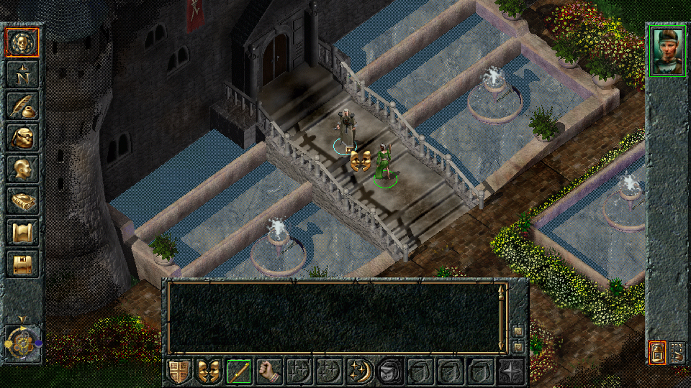

# Enhanced Widescreen

- [Overview](#overview)
- [Supported Games](#supported-games)
- [Features](#features)
  - [Engine Improvements](#engine-improvements)
  - [Quality of Life Additions](#quality-of-life-additions)
  - [Notable Engine Fixes](#notable-engine-fixes)
- [Installation](#installation)
- [Advanced Tweaks](#advanced-tweaks)
  - [Custom Resolutions](#custom-resolutions)

# Overview

Enhanced Widescreen aims to supersede the original [Widescreen Mod](https://github.com/Gibberlings3/widescreen) for select Infinity Engine games.

# Supported Games

- Baldur's Gate (Original, non-EE) – GOG distribution recommended

  

# Features

## Engine Improvements

- Support for widescreen resolutions:

  - Numerous patches / fixes have been made to the engine to account for the use of arbitrary resolutions.

  - The game's GUI is modified on-the-fly to better position GUI elements when using non-standard resolutions.

    **Note:** The original game assets are still used, and likely will not cover the entirety of the game window at higher resolutions. Screen space not covered by the original artwork will appear black, (except on the world screen).

- Increased refresh rate:

  - Certain portions of the engine have been tweaked to benefit from an increased fps cap, including mouse movement / world scrolling. Most aspects of the game remain capped at 30 updates a second, and will therefore appear as they do without the mod.

- Seamless alt-tabbing / fullscreen <-> windowed mode transitions:

  - Much thanks goes to [cnc-ddraw](https://github.com/FunkyFr3sh/cnc-ddraw) (and its contributors) for being integral to this functionality.

## Quality of Life Additions

  - Middle mouse scrolling.
  - Softcoded scrolling keys, (see `Keymap.ini` after installing the mod).

## Notable Engine Fixes

  - The game's installation path is no longer limited to ~80 characters.
  - Some spurious game freezes will no longer occur.
  - Input will continue to work even in the presence of (previously) conflicting software.

# Installation

The latest version of Enhanced Widescreen can be downloaded from the [**Releases**](https://github.com/Bubb13/EnhancedWidescreen/releases) page:

1. Download the installer `zip` located under the collapsible "**Assets**" menu.
2. Extract the `zip`'s contents into the game installation such that `setup-EnhancedWidescreen.exe` sits in the same folder as `BGMain2.exe`.
3. Run `setup-EnhancedWidescreen.exe` and follow the prompts.

**Note:** After installing Enhanced Widescreen, the game **must** be started with `InfinityLoader.exe` (now in the game folder) for the mod to work.

- Antivirus solutions might flag `InfinityLoader.exe` as a virus. **This is a false positive**, and is usually triggered because Infinity Loader patches the game executable during runtime. Infinity Loader's code is [open source](https://github.com/Bubb13/InfinityLoader) and available for anyone to view.

# Advanced Tweaks

## Custom Resolutions

- Enhanced Widescreen displays a resolution selection prompt when starting the game. The list of resolutions presented by the prompt is generally predetermined, though a custom resolution may be added to the list by modifying the `inject_resolution` key in `ddraw.ini`.
